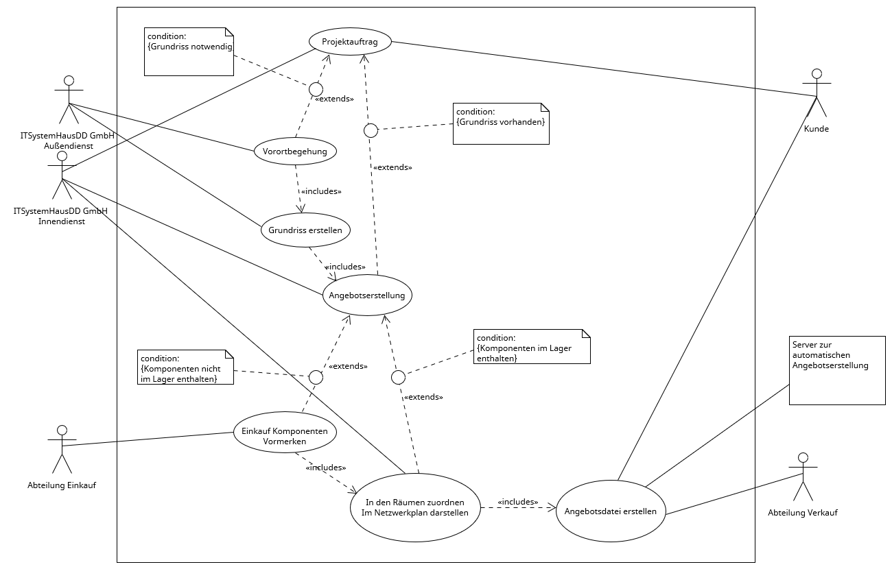

### Beteiligte des Geschäftsprozesses
- ITSystemhausDD GmbH Außendienst
- ITSystemhausDD GmbH Innendienst
- Abteilung Einkauf
- Abteilung Verkauf
- Server zur automatischen Angebotserstellung 

### Zielplatform für die Softwarentwicklung
- Linux weil:
  - sehr einfaches Arbeiten mit Python
  - Opensource
  - Ressourcensparend

  ### Vergleich von Python mit C#
#### Vorteile Python:
- dynamische Typisierung, welche auch statisiert werden kann
- Erfahrungen der Entwickler
- einfacher Datenbankzugriff über <code>SqlAlchemy</code>
- Funktioniert auf allen gängigen Betriebssystemen
- wenig Klickibunti
- Syntax

#### Vorteile C#:
- viel Klickibunti
- statische Typisierung

#### Nachteile C#:
- nur mit Windows kompatibel
- umständliches Einbinden von Datenbanken

### Use-Case-Diagramm

[Use-Case Diagramm PDF](use-case.pdf)